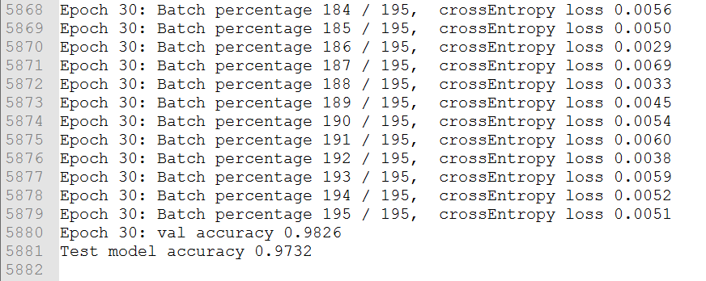

# SimpleNN4Mnist
一个用于手写体识别的“自制”的神经网络。  
备注：自己本来想写一个包含有卷积层和池化层的网络，可惜后来没能调试成功。

## 1. 基本的连接方式
    Input（28*28）-----> 向量化（784）----->全连接1（512）----->全连接2（64）----->全连接3（10）----->交叉熵（Softmax）

## 2. 基本设置参数
* Batch size： 128；
* 训练数据量：30000，其中交叉验证的数据量：5000；
* Epoch： 30；
* learning_rate： 0.01；

## 3. 运行方式
在Windows对应的CMD文件路径下： python cnn_mnist.py | tee 2>&1 log.txt，    注：log.txt是日志文件

## 4. 运行结果

在mnist的整个test数据集上，正确率在**97.xx%**左右。
## 5. 参考资料
1. [**mnist data read：** https://gist.github.com/akesling/5358964](https://gist.github.com/akesling/5358964)
2. [**MATLAB：** https://github.com/xuzhenqi/cnn](https://github.com/xuzhenqi/cnn) 
3. [**Python：** https://github.com/andersbll/nnet/](https://github.com/andersbll/nnet/)
4. [Backpropagation In Convolutional Neural Networks](http://www.jefkine.com/general/2016/09/05/backpropagation-in-convolutional-neural-networks/)
5. [Convolutional Neural Networks backpropagation: from intuition to derivation](https://grzegorzgwardys.wordpress.com/2016/04/22/8/)
6. [**How the backpropagation algorithm works**](http://neuralnetworksanddeeplearning.com/chap2.html)
7. [**Principles of training multi-layer neural network using backpropagation**](http://home.agh.edu.pl/~vlsi/AI/backp_t_en/backprop.html)
